# Curso de Backend con Node.js

## ¿Qué es Node.js?
Node.js es un entorno de ejecución para javascript

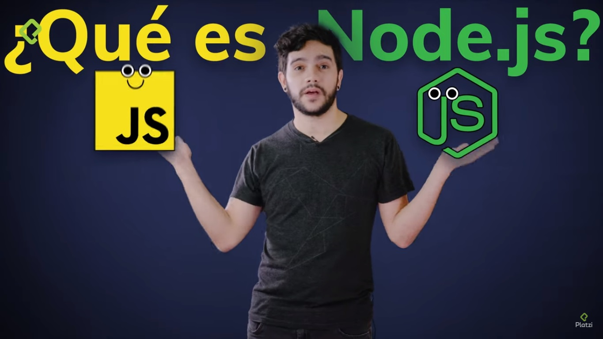

construida con el motor v8 de Chrome.

## ¿Qué es un entorno de ejecución?
Del ingles Runtime System Runtime Enviroment es una capa encima del OS que ejecuta un pieza de software

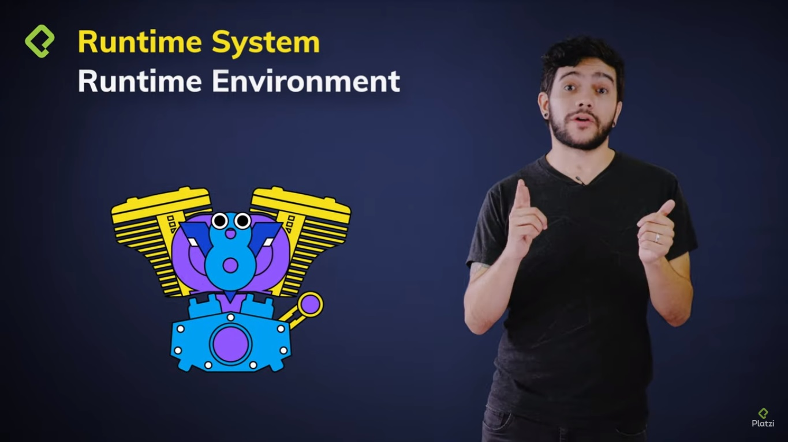

esta capa es responsable de seguir como consume la memoria, como accede a las variables, como debe pasar los parametros, entre los diferentes procedimientos

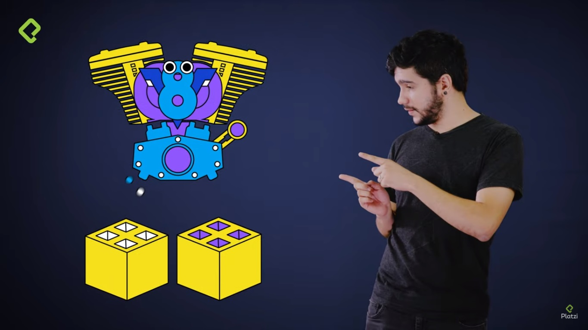

ademas sabe cuando y como debe ejecutar el Garbage Collector.

## Y ¿Qué es Chrome v8?
Es un motor open source de javascript, para los navegadores chrome y chromiun

Gracias a su técnologia **just in time compiler** Compila código javascript

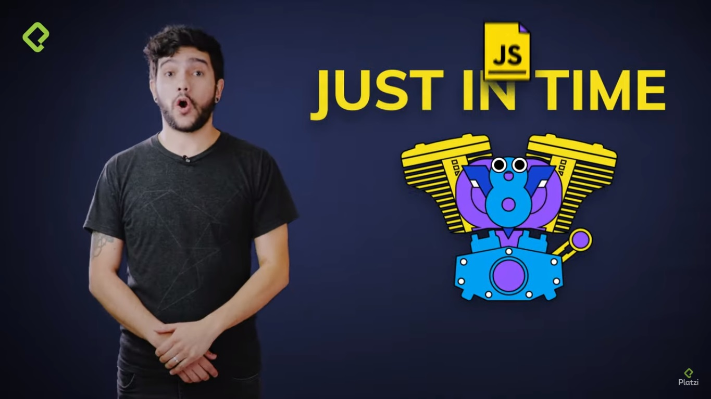

Originalmente JavaScript no fue concevido como un lenguaje compilado sino interpretado

Node.js es el resultado de tomar el motor de chrome v8 para crear un entorno de ejecución y haci ejecutar javascript del lado del servidor.
 
## Notas del curso
Recordemos que los lenguajes interpretados se ejecutan muy rapido, pero cuando hay un loop de código muy seguido se demora, por que cada vez que pasa por esa linea, tiene que volver a interpretar, a diferencia de los lenguajes compilados que se demoran mucho en cargar por que tiene que pasar por el proces ode compilación, luego se ejecutan muy rapido por que ya ha sido compilado.
 
Es importante mencionar esto por que javascript era interpretado pero puede ser compilado con una tecnologia llamada just in time compiler, esta tecnologia tiene un monitor que se encarga de revisar cada cuanto se ejecuta niestro código.

Si el código se ejecuta mucho en un estado ONE, lo que hace es que ese código se compila y si ese código compilado se ejecuta muchas veces se pone en un estado HOT, que es basicamente hacer una optimización a ese codigo compilado para que cuando se llame, llame a la versión optimizada.

Asi que Node.js hace es tomar el engine de JavaScript chrome v8 para crear un entorno de ejecución del lado del servidor, recordemos que tenemos otros engines de JS:
* Spider Monkey - Mozilla
* JavaScript Core - Zafari
* Chaka - Edge

Fechas importantes
* 2009 -  Ryan Dahl mostro al mundo node.js
* 2011 - Linkedin usa node.js en producción
* 2013 - aparee Ghost una plataforma de plugins y a la vez paypal saca un framework de node.js llamado crakeqn
* 2015 - nace la competencia de node.js llamado io.js pero se reconcilian y crean lo que es llamado la node.js foundation
* 2017 - Node.js se vuelve mainstrain con 8.8 millones de instancias funcionando

## Diferencias entre Node.js y JavaScript
En JavaScript del lado del cliente tenemos el DOM y el CSSDOM así como el objeto window para manipular los elementos de nuestra página además una serie de APIs, aquí unos ejemplos:

* fetch
* SessionStorage y LocalStorage
* canvas
* bluetooth
* audio
* web authentication
Mientras que en Node.js no tenemos un DOM ni un objeto windows, lo que sí tenemos son una serie de módulos que nos permiten interactuar con los recursos de la máquina como el sistema operativo y el sistema de archivos, por ejemplo:

* os
* fs
* http
* util
* debugger
* stream
* events

## Resumen de lo aprendidio hasta la clase 8

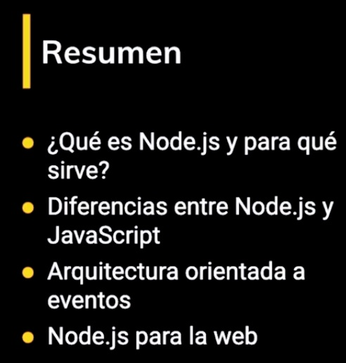

## Streams
Los Streams son una colección de datos como los arrays o strings sólo que se van procesando pedazo por pedazo, esta capacidad los hace muy poderosos porque podemos manejar una gran cantidad de datos de manera óptima.

## Los Readasble and Writeable
Tienen eventos y funciones, tienen eventos por que heredan de la clase event emiter.
Los Readable y Writeable streams tienen los siguientes eventos y funciones respectivamente:

### Readable
#### Eventos
* **data**. Se dispara cuando recibe datos.
* **end**. Se dispara cuando termina de recibir datos.
* **error**. Se dispara cuando hay un error.
#### Funciones
* pipe
* unpipe
* read
* push
### Writeable
#### Eventos
* **drain**. Se dispara cuando emite datos.
* **finish**. Se dispara cuando termina de emitir.
* **error**. Se dispara cuando hay un error.
#### Funciones
* write
* end
Recuerda que tienen estos eventos porque los heredan de la clase EventEmitter.

## Express
### ¿Qué es?
Es un framework para crear aplicaciones web, web services o web APIs, lo interesante de express es que free open source bajo la licencia MIT, y fue inspirada por el framework Sinatra escrito en Ruby por TJ Holowaychuk 

### Un poco de Historia
En el 2014 los derechos de express fueron adquiridos por StrongLoop
En el 2015 StrongLopp fue adquirido por IBM
En el 2016 tuvimos la buena noticia de que express seria dirigido por la node js foundation
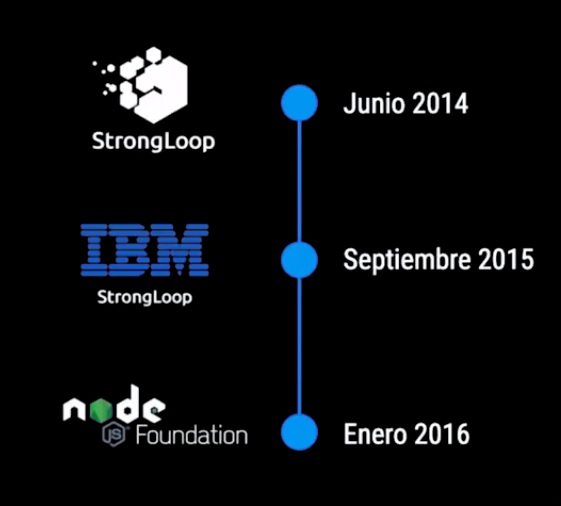

### Características
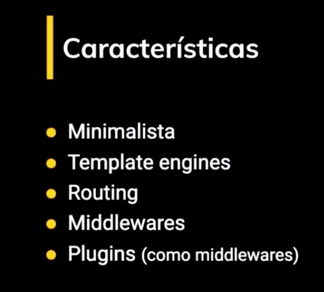

## Rest
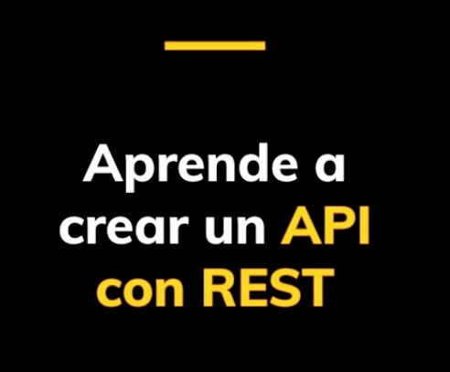

### Anatomia de una API Restful
Representational State Transfer  es un estilo de arquitectura para construir web services

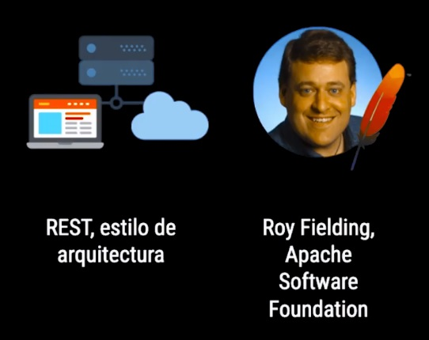

### ¿De qué se trata REST?

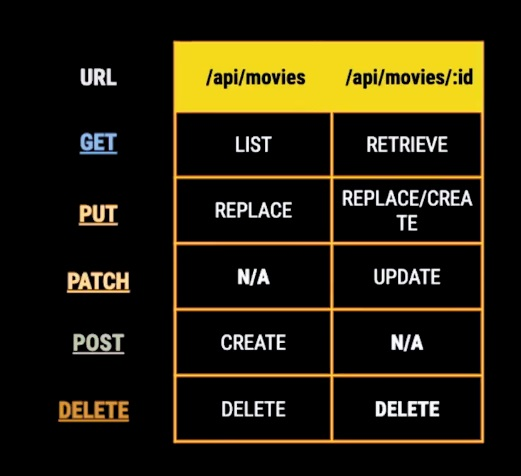

## CRUD

### Creacion de rutas
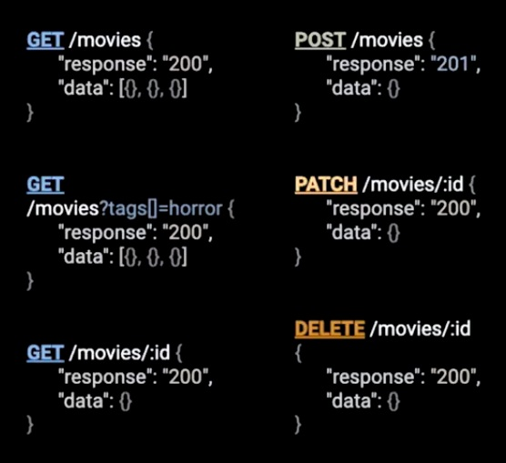

